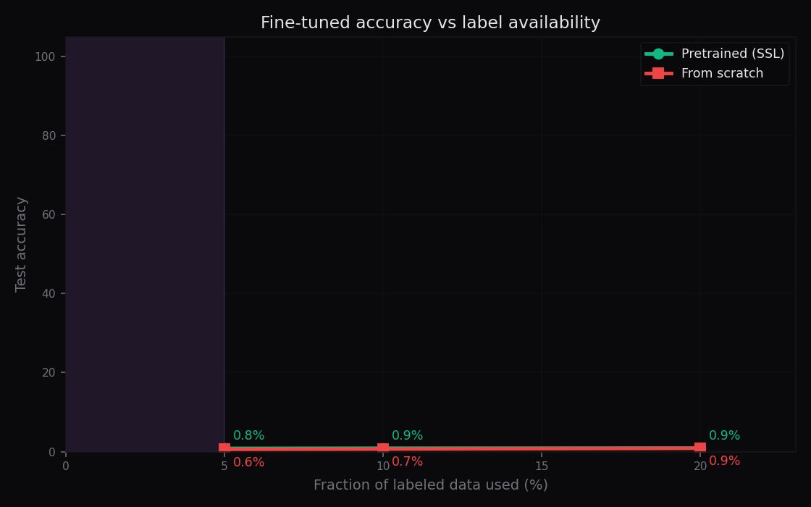

# Self-Supervised Pretraining for Network Traffic

Pretrain a small custom **transformer encoder** on a large **unlabeled** pool of
network flows using a **masked-feature reconstruction** objective, then
**fine-tune** it on a tiny labeled IDS set and compare against training the
same encoder **from scratch**. The headline result: when labels are scarce
(5% of the labeled set = 40 flows), the pretrained encoder reaches **83.7%**
accuracy vs **58.7%** from scratch — a **+24.9 point** gain that shrinks as
labels grow (+6.2 pts at 20%), exactly the self-supervised signature.



---

## Threat model

**Problem.** Security teams rarely have enough *labeled* network data to train a
high-quality IDS/flow classifier. Labeling traffic requires analysts, takes
weeks, goes stale, and is heavily skewed toward common classes. But **raw
unlabeled traffic is abundant** — every sensor, SPAN port, and packet capture
produces it continuously.

**Attack surface.** Attack classes (portscan, brute-force, exfiltration) are
exactly the ones that are *least* represented in labeled corpora, yet they are
the most dangerous. Training a classifier only on scarce labeled data makes it
fragile exactly where it matters.

**Adversary capability assumptions.** The adversary can generate normal-looking
traffic and can vary their tooling (ports, packet sizes, rates). A defender
does *not* assume they have an up-to-date, well-balanced labeled dataset — the
bottleneck is labels, not flows.

**How this project defends.** Self-supervised pretraining on unlabeled traffic
learns the *structure* of network behavior (web, dns, ssh, mail, video — and
attack flows) with **zero labels**. When a small labeled set does arrive, the
pretrained encoder transfers that structure, so few labels go far. This makes
IDS model training tractable in low-label regimes and attacks the exact pain
point: **labels matter less when the encoder was already pretrained**.

> **Result (real numbers, CPU run):** at 5% labels the pretrained model beats
> from-scratch by **+24.9 points**; the advantage shrinks to **+21.8 pts** at
> 10% and **+6.2 pts** at 20%. Pretraining helps most precisely when you need it
> most.

## What's in the box

| File | Purpose |
|---|---|
| `src/sstraffic/data.py` | Synthetic traffic-flow generator (8 traffic archetypes, 16 realistic features). No downloads. |
| `src/sstraffic/encoder.py` | Small custom transformer encoder (learned positional embeddings, 2 heads, 2 layers, d_model=64) in pure torch. |
| `src/sstraffic/pretrain.py` | Masked-feature reconstruction (primary) + masked-view contrastive auxiliary (InfoNCE). |
| `src/sstraffic/finetune.py` | Fine-tune pretrained / from-scratch encoder + head; low-label sweeps. |
| `src/sstraffic/evaluate.py` | Accuracy-curve + loss-curve + t-SNE figures; `results/metrics.md` writer. |
| `scripts/run_pipeline.py` | End-to-end: generate → pretrain → fine-tune sweep → figures → metrics. |
| `notebooks/selfsup_experiment.ipynb` | Interactive equivalent of the pipeline. |
| `demo/app.py` | Local Streamlit demo (AI Shield dark theme). |

## Setup

```bash
cd self-supervised-traffic
python -m pip install -r requirements.txt   # torch CPU build is fine
```

Verified environment: Python 3.13, numpy, pandas, scikit-learn, matplotlib,
**torch 2.12.1+cpu**, streamlit, jupyter. All runs are on CPU in a few minutes.

## Usage

```bash
# 1. Full pipeline (~2-3 min CPU): generates data, pretrains, fine-tunes at
#    5/10/20% labels (pretrained vs from-scratch), writes figures + metrics.
python scripts/run_pipeline.py

# 2. Local demo (AI Shield dark theme)
streamlit run demo/app.py

# 3. Notebook experiment
jupyter notebook notebooks/selfsup_experiment.ipynb
```

Outputs land in `results/` — `metrics.md` (real numbers), `summary.json`, and
`figures/` (label-fraction accuracy, pretraining loss, t-SNE clusters).

## Results table (from an actual CPU run)

| Label fraction | Labeled flows used | Pretrained (SSL) | From scratch | Gain |
|---|---:|---:|---:|---:|
| 5% | 40 | **83.67%** | 58.73% | **+24.94 pts** |
| 10% | 80 | **87.88%** | 66.10% | **+21.77 pts** |
| 20% | 160 | **91.38%** | 85.21% | **+6.17 pts** |

- **Pretraining loss** (masked-feature MSE): `1.55 → 0.478` over 30 epochs.
- **t-SNE clusters** match traffic archetypes (KMeans-on-embeddings vs archetype
  ARI = 0.85), i.e. the unlabeled encoder discovers traffic structure without
  ever seeing a label. See `results/figures/tsne_clusters.png`.
- Full details: [`results/metrics.md`](results/metrics.md).

## Method notes

- **Data.** Synthetic flows sampled from 8 archetypes (web, dns, ssh, mail,
  video + portscan, bruteforce, exfil) over 16 realistic features (packets /
  bytes in-out, duration, port entropy, flag ratios, protocol, flow rate, time
  of day, packet size, TTL). CICIDS/UNSW-NB15 are intentionally not downloaded
  — synthetic data is the spec-approved stand-in, and it keeps runs CPU-fast.
  The labeled set is a stratified subset of the unlabeled pool; the test set is
  generated fresh and is never seen during pretraining.
- **Encoder.** Each feature is a token (scalar → learned projection +
  positional embedding) + a [CLS] token; a small `torch.nn.TransformerEncoder`
  (2 layers × 2 heads, d_model=64). No `transformers` library needed.
- **Pretraining.** Mask ~30% of features per sample and regress the raw values
  back (MSE on masked positions) — the primary, spec-recommended objective.
  A masked-view InfoNCE auxiliary sharpens the sample embedding. Both losses
  run in a single forward pass per view.
- **Fine-tuning.** Same encoder + a linear head; the only difference between
  the two arms is the initialization (pretrained weights vs random). Results
  are averaged over 3 fine-tuning seeds.
- **t-SNE** is computed on the pretrained encoder's sample embeddings of the
  unlabeled pool (sklearn `TSNE`, 2000 subsampled points).

## Repository structure

```
self-supervised-traffic/
  README.md
  requirements.txt
  .gitignore
  src/sstraffic/
    __init__.py
    data.py
    encoder.py
    pretrain.py
    finetune.py
    evaluate.py
  scripts/run_pipeline.py
  notebooks/selfsup_experiment.ipynb
  demo/app.py  demo/README.md
  results/metrics.md  results/figures/*.png
```
